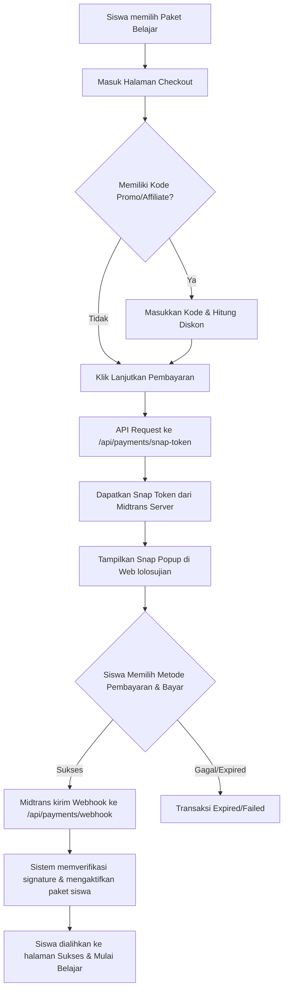

# Alur Transaksi & Pembayaran Midtrans - lolosujian

Dokumen ini menjelaskan alur transaksi lengkap dari sisi pengguna mulai dari pemilihan paket, pengisian kupon/affiliate, integrasi Midtrans Snap Popup, hingga verifikasi otomatis oleh sistem.

---

## 📈 Diagram Alur Transaksi (Flowchart)

---

## 📸 Langkah Demi Langkah & Detail Screenshot

### Langkah 1: Memilih Paket Belajar (Pricing Page)
Siswa mengunjungi halaman harga (`/harga`) untuk melihat dan memilih paket belajar yang tersedia.
* **Paket yang tersedia:** Gratis, Belajar (6 bulan), dan Belajar Full (Selamanya).
* **Tindakan:** Siswa menekan tombol **"Mulai Belajar"** pada paket **Belajar** (Early Bird).

---

### Langkah 2: Verifikasi Checkout & Pengisian Kode Promo/Affiliate
Siswa diarahkan ke halaman checkout (`/pembayaran?paket=belajar`). Di sini siswa harus:
1. Membaca dan mencentang **Syarat Layanan** serta **Kebijakan Refund**.
2. Memasukkan kode promo (misal: `LOLOSPTN26`) atau kode affiliate partner jika ada.
3. Menekan tombol **"Lanjutkan pembayaran"**.

---

### Langkah 3: Antarmuka Pembayaran Midtrans Snap
Setelah menekan tombol pembayaran, web akan memanggil API Route `/api/payments/snap-token` untuk mendapatkan token transaksi unik, kemudian membuka pop-up **Midtrans Snap**.
* **Pilihan Pembayaran:** Siswa dapat membayar secara instan melalui QRIS/GoPay, Virtual Account bank (BCA, Mandiri, BNI, BRI), atau Kartu Kredit.
* **Tindakan:** Siswa melakukan transfer pembayaran sesuai dengan petunjuk instan yang diberikan.

---

### Langkah 4: Pembayaran Berhasil & Aktivasi Paket
Begitu transfer berhasil diselesaikan, Midtrans mengirimkan notifikasi instan (Webhook) ke backend aplikasi. Backend akan secara otomatis memverifikasi keabsahan data dan mengaktifkan paket belajar siswa.
* **Tampilan Akhir:** Siswa dialihkan ke halaman sukses (`/pembayaran/status?status=success`) dan dapat langsung menekan tombol **"Mulai Belajar Sekarang"** untuk membuka semua tryout premium.

