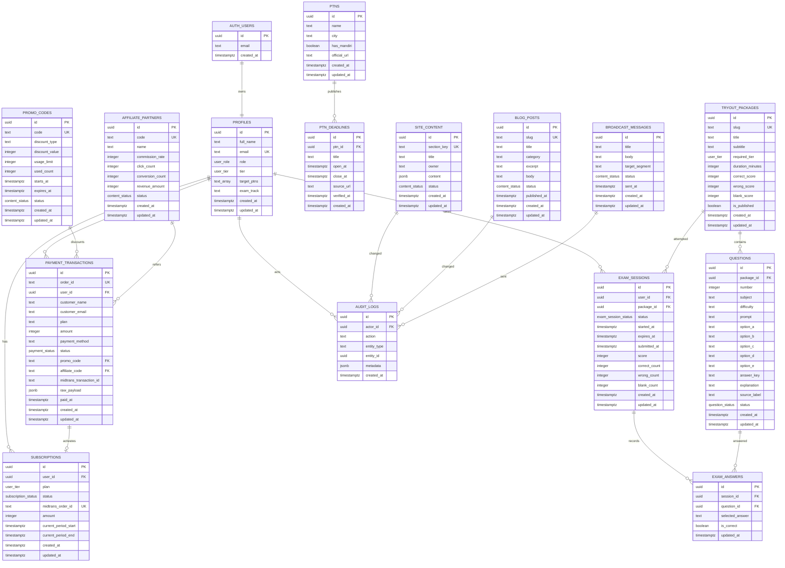

# Pastilulus Production ERD

Dokumen ini merangkum rancangan data produksi Pastilulus untuk kebutuhan publik, handoff developer, dan review produk. ERD ini fokus pada domain bisnis: akun, paket belajar, transaksi, promo/affiliate, tryout, informasi PTN, konten website, dan audit admin.

## Domain Utama

1. **Identity & Access**: profil pengguna, role admin, tier paket.
2. **Billing & Subscription**: transaksi pembayaran, subscription aktif, promo, affiliate.
3. **Learning & Tryout**: paket tryout, bank soal, sesi ujian, jawaban siswa.
4. **PTN Information**: data PTN dan deadline jalur mandiri.
5. **Content CMS**: landing page, blog, broadcast.
6. **Admin Governance**: audit log aktivitas admin dan sistem.

## ERD

## Table Dictionary

| Table | Fungsi | Akses |
| --- | --- | --- |
| `profiles` | Profil aplikasi untuk Supabase Auth user. Menyimpan role, tier, target PTN, dan preferensi dasar. | User sendiri dan admin. |
| `payment_transactions` | Ledger transaksi checkout. Satu order ID dicatat sejak transaksi dibuat sampai paid/expired/failed. | User sendiri dan admin. |
| `subscriptions` | Status paket aktif pengguna setelah pembayaran berhasil. | User sendiri dan admin. |
| `promo_codes` | Kode promo yang bisa dipakai saat checkout. | Admin. |
| `affiliate_partners` | Partner referral/affiliate dan performa konversi. | Admin. |
| `ptns` | Master data kampus/PTN. | Publik baca, admin tulis. |
| `ptn_deadlines` | Jadwal pendaftaran, deadline, dan sumber resmi. | Publik baca, admin tulis. |
| `tryout_packages` | Paket simulasi ujian. | Publik baca yang published, admin tulis. |
| `questions` | Bank soal, opsi jawaban, pembahasan, dan status review. | Published untuk user, admin untuk review. |
| `exam_sessions` | Attempt tryout siswa, timer, skor, dan ringkasan hasil. | User sendiri dan admin. |
| `exam_answers` | Jawaban per soal dalam satu attempt. | User sendiri dan admin. |
| `site_content` | Konten landing page dan section website. | Published untuk publik, admin tulis. |
| `blog_posts` | Artikel blog/tips belajar. | Published untuk publik, admin tulis. |
| `broadcast_messages` | Draft dan riwayat broadcast notifikasi. | Admin. |
| `audit_logs` | Jejak perubahan penting oleh admin/sistem. | Admin. |

## Status Enum

| Enum | Values |
| --- | --- |
| `user_role` | `student`, `admin`, `super_admin` |
| `user_tier` | `free`, `belajar`, `pro` |
| `subscription_status` | `pending`, `active`, `expired`, `cancelled` |
| `payment_status` | `pending`, `paid`, `expired`, `failed` |
| `question_status` | `draft`, `review`, `published`, `rejected`, `archived` |
| `exam_session_status` | `in_progress`, `submitted`, `expired` |
| `content_status` | `draft`, `published`, `archived` |

## Alur Data Produksi

### 1. Signup dan Profil

1. User membuat akun melalui Supabase Auth.
2. Trigger membuat `profiles`.
3. Role default `student`, tier default `free`.
4. Admin dapat mengubah role/tier melalui admin portal jika diperlukan.

### 2. Checkout dan Subscription

1. User memilih paket di halaman harga.
2. Server membuat `payment_transactions` dengan status `pending`.
3. User diarahkan ke penyedia pembayaran.
4. Webhook memverifikasi signature dan mengubah status transaksi.
5. Jika paid, sistem membuat/memperbarui `subscriptions` dan menaikkan `profiles.tier`.

### 3. Promo dan Affiliate

1. Admin membuat `promo_codes` dan `affiliate_partners`.
2. Checkout menyimpan `promo_code` dan `affiliate_code` pada `payment_transactions`.
3. Saat transaksi paid, sistem dapat menaikkan `used_count`, `conversion_count`, dan `revenue_amount`.

### 4. Tryout dan Scoring

1. Admin membuat `tryout_packages`.
2. Admin mengimpor/menulis `questions`, lalu review sampai `published`.
3. User memulai ujian dan sistem membuat `exam_sessions`.
4. Jawaban tersimpan di `exam_answers`.
5. Saat submit, sistem menghitung skor dan menyimpan ringkasan di `exam_sessions`.

### 5. Konten Publik

1. Admin mengubah landing page di `site_content`.
2. Admin menulis artikel di `blog_posts`.
3. Hanya konten `published` yang tampil untuk publik.
4. Perubahan penting dicatat di `audit_logs`.

## Privacy dan Security

- Data pembayaran sensitif tidak disimpan penuh. Sistem hanya menyimpan order ID, nominal, status, metode, dan payload webhook seperlunya.
- `raw_payload` dipakai untuk audit teknis, bukan untuk menampilkan data ke publik.
- User hanya boleh membaca data miliknya sendiri.
- Admin access dibatasi oleh `profiles.role`.
- Service role hanya dipakai di server, tidak pernah dikirim ke browser.
- Public pages hanya membaca konten/status yang sudah `published`.

## Production Readiness Checklist

- [x] Tabel utama akun, pembayaran, tryout, PTN, konten, dan audit tersedia.
- [x] RLS aktif untuk tabel inti.
- [x] Order checkout tercatat sebelum redirect pembayaran.
- [x] Webhook pembayaran idempotent berdasarkan `order_id`.
- [x] Admin portal membaca data produksi dengan fallback lokal.
- [ ] Counter promo/affiliate otomatis bertambah saat payment paid.
- [ ] `broadcast_messages` dibuat sebagai migration SQL aktif.
- [ ] Landing page dan blog publik sepenuhnya membaca `site_content` dan `blog_posts`.
- [ ] Materialized view/summary untuk dashboard admin saat data besar.
- [ ] Audit log ditulis untuk semua aksi admin penting.

